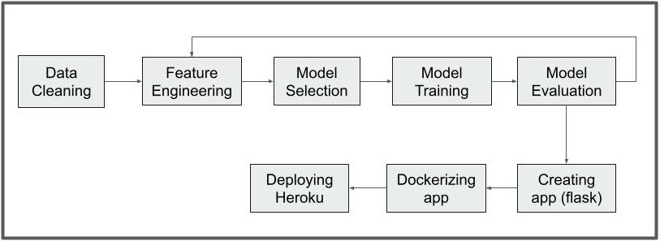

# clustering_deployment

### Description  

The project is based on Machine Learning. The objective is to deploy a web-application using flask and heroku model to predict the new client belong to which cluster based on data of 10,000 bank's clients.

### Installation
The libraries on the `requirements.txt` should be installed in order to run the program.
Use `pip install requirements.txt` for installation.

### Usage  
Follow these steps to run the program:

1. Download the main branch of the repository. Along with the `README.md`, it consists of three folders `churn_main`, `templates` and `static`
2. Start with `churn_main`, which consists of two folders `preprocessing`,  `predict` and the model file `KmeansModel.joblib`
3.Install the libraries in `requirements.txt`.
4. Save the provided data in the json format in the repository folder.
5. Go to folder `preprocessing` and run the `data_preprocessing.ipynb` to have a clean dataset for the model.
6. Go to folder `predict` and run the `model.ipynb` to train the model and save it.
7. Ran the `app.py` to create the web-application .
8. Install the `Dockerfile`.
9. Build the image using this syntax in the terminal `docker build -t clustering_application` 
10. Run the container using this syntax in the terminal `docker run -d -p 5000:5000 clustering_application`
11. Login heroku using this syntax in the terminal `heroku container:login`
12. Create the container onto `Heroku` using this syntax in the terminal `heroku container:push web --app clustering_application`
13. Release the container  using this syntax in the terminal `heroku container:release web --app clustering_application`

### Program flow  

### Output

