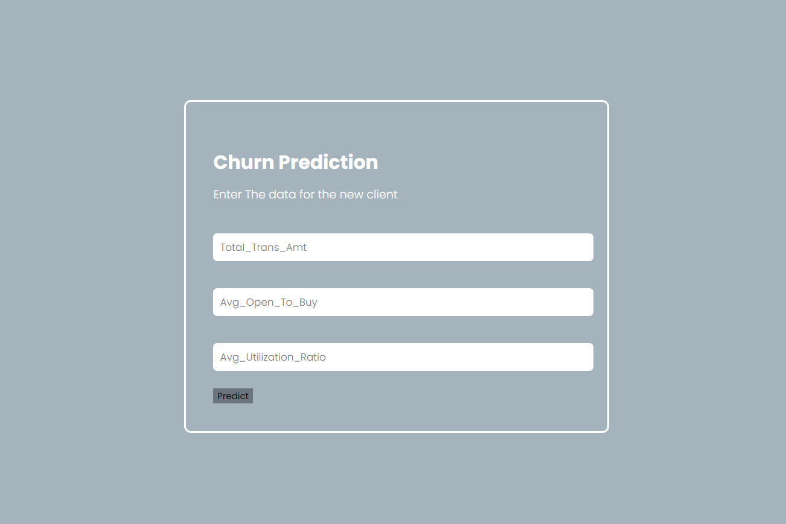

# clustering_deployment

### Description  

The project is based on Machine Learning. The objective is to make a model to predict the new client belong to which cluster based on data of 10,000 bank's clients.

### Installation
The libraries on the `requirements.txt` should be installed in order to run the program.
Use `pip install requirements.txt` for installation.

### Usage  
Follow these steps to run the program:

1. Download the main branch of the repository. Along with the `README.md`, it consists of two folders `preprocessing`,  `predict` and the model file `KmeansModel.joblib`
2. Install the libraries in `requirements.txt`.
3. Save the provided data in the json format in the repository folder.
4. Go to folder `preprocessing` and run the `data_preprocessing.ipynb` to have a clean dataset for the model.
5. Go to folder `predict` and run the `model.ipynb` to train the model and save it.
6. Ran the `app.py` to create the web-application .
7. Install the `Dockerfile`.
8. Build the image and container based on the `Dockerfile`.
9. Deploy the application in `heroku`

### Program flow  

### Output

### Future works
1. Improve the code to predict the current revenue as there are many Null values in the current revenue.
2. Prediction based on company category and detecting and handling the outliers.
3. Minimize the zero values in the staff cost based on the staff count.
4. Fine tuning the hyperparameters.
